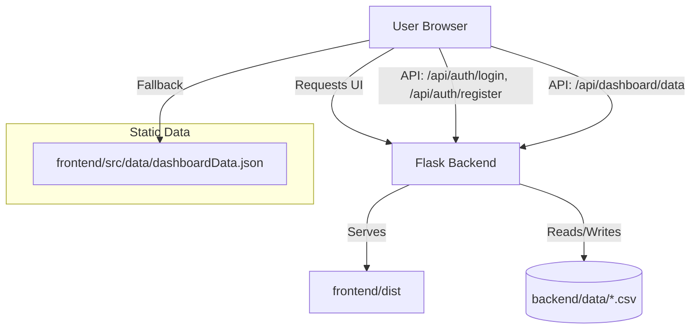

<div align="center">

# 🛡️ Aadhaar Setu

**Data-Driven Insights for Aadhaar Services**

[](https://aadhaar-setu-to06.onrender.com)
[](https://flask.palletsprojects.com/)
[](https://reactjs.org/)
[](https://vitejs.dev/)
[](LICENSE)

A unified platform providing aggregated analytics, AI-powered recommendations, and streamlined services for citizens and administrators across India.

> 🔒 **Privacy Protected** — No Aadhaar numbers are collected or displayed.

</div>

---

## 📌 Table of Contents

- [What is this project?](#-what-is-this-project)
- [Live Demo](#-live-demo)
- [Tech Stack](#-tech-stack)
- [Architecture](#-architecture-diagram)
- [User Roles](#-user-roles)
- [Repo Structure](#-repo-structure)
- [Key Behaviors](#-key-behaviors)
- [Prerequisites](#-prerequisites)
- [Install & Run](#-install-and-run)
- [API Reference](#-api-reference)
- [Data Files](#-data-files)
- [Contributing](#-contributing)
- [License](#-license)

---

## 🌐 What is this project?

**Aadhaar Setu** is an interactive demo of a UIDAI-style service portal and analytics dashboard. It is a proof-of-concept hackathon project that:

- Authenticates users via `backend/routes/auth.py`
- Loads dashboard metrics from CSV data in `backend/data/`
- Supports **role-based experiences** for public users, block officers, district officers, state officers, and national administrators
- Provides a modern frontend with **React, Tailwind CSS,** and rich data visualizations

---

## 🚀 Live Demo

🌍 **[https://aadhaar-setu-to06.onrender.com](https://aadhaar-setu-to06.onrender.com)**

> ⚠️ Hosted on Render's free tier — the first load may take 30–60 seconds to wake up.

---

## 🛠️ Tech Stack

| Layer | Technology |
|---|---|
| Frontend | React 18 + TypeScript |
| Bundler | Vite |
| Styling | Tailwind CSS |
| Charts | Recharts |
| Backend | Python 3 + Flask |
| Auth | CSV-based (demo only) |
| Data Storage | CSV files |
| Deployment | Render (free tier) |

---

## 🏗️ Architecture Diagram



---

## 👥 User Roles

| Role | Access Level | Description |
|---|---|---|
| Public User | Basic | View personal Aadhaar service status |
| Block Officer | Block | View block-level analytics and appointments |
| District Officer | District | District-wide insights and grievance management |
| State Officer | State | State-level dashboards and reporting |
| National Admin | Full | Complete platform access and administration |

---

## 📁 Repo Structure

```
Aadhaar-Setu-final/
├── backend/
│   ├── app.py              # Flask application entrypoint
│   ├── config.py           # File path definitions and configuration
│   ├── utils.py            # CSV read/write helpers
│   ├── requirements.txt    # Python dependencies
│   ├── routes/
│   │   ├── auth.py         # Login and registration endpoints
│   │   └── api.py          # Dashboard data endpoint
│   └── data/
│       ├── users.csv       # User accounts and roles
│       ├── records.csv     # Records for dashboard statistics
│       └── centres.csv     # Centre and location metadata
└── frontend/
    ├── package.json        # Frontend dependencies and scripts
    ├── vite.config.ts      # Vite configuration
    └── src/
        ├── contexts/
        │   ├── AuthContext.tsx   # Login/register and session management
        │   └── DataContext.tsx   # Live data fetching with offline fallback
        ├── pages/               # Role-based dashboard pages
        ├── data/
        │   └── dashboardData.json  # Static fallback data
        └── public/              # Static assets
```

---

## ⚙️ Key Behaviors

| Behavior | Details |
|---|---|
| **Backend-first** | App always tries `/api/dashboard/data` first |
| **Offline fallback** | Falls back to `dashboardData.json` if Flask is down |
| **User auth** | `POST /api/auth/login` and `POST /api/auth/register` use `users.csv` |
| **Dashboard data** | `GET /api/dashboard/data` aggregates from `records.csv` + user metadata |
| **SPA support** | Flask serves the React SPA and redirects unknown routes to `index.html` |

---

## ✅ Prerequisites

- **Python** 3.8 or higher
- **Node.js** 16 or higher
- **npm** 7 or higher

---

## 📦 Install and Run

### 1. Clone the repository

```bash
git clone https://github.com/h13665383-oss/Aadhaar-Setu-final.git
cd Aadhaar-Setu-final
```

### 2. Run the backend

```bash
cd backend
pip install -r requirements.txt
python app.py
```

The backend starts on port **5001** by default.

### 3. Build or run the frontend

**Production build** (served by Flask):
```bash
cd frontend
npm install
npm run build
```

Then open [http://localhost:5001](http://localhost:5001) in your browser.

**Frontend development mode** (hot reload):
```bash
cd frontend
npm install
npm run dev
```

> In dev mode, the frontend runs on `http://localhost:5173` and proxies API calls to Flask on port 5001.

---

## 📡 API Reference

| Method | Endpoint | Description |
|---|---|---|
| `POST` | `/api/auth/login` | Authenticate user, returns session token |
| `POST` | `/api/auth/register` | Register a new user account |
| `GET` | `/api/dashboard/data` | Fetch aggregated dashboard statistics |

---

## 📂 Data Files

| File | Description |
|---|---|
| `backend/data/users.csv` | User accounts and roles for authentication |
| `backend/data/records.csv` | Records used to compute dashboard statistics |
| `backend/data/centres.csv` | Centre and location metadata |

> 💡 **Tip:** Editing these CSV files changes the demo data immediately — no restart needed.

---

## 🤝 Contributing

Contributions are welcome! Here's how to get started:

### Step-by-step

1. **Fork** the repository on GitHub
2. **Clone** your fork:
   ```bash
   git clone https://github.com/<your-username>/Aadhaar-Setu-final.git
   cd Aadhaar-Setu-final
   ```
3. **Create a new branch** for your changes:
   ```bash
   git checkout -b feature/your-feature-name
   ```
4. **Make your changes** (see ideas below)
5. **Commit** with a clear message:
   ```bash
   git commit -m "feat: add <short description>"
   ```
6. **Push** to your fork:
   ```bash
   git push origin feature/your-feature-name
   ```
7. Open a **Pull Request** against the `main` branch

### 💡 Good first contribution ideas

- 📝 Improve this README (more details, fix typos, add screenshots)
- 🎨 Enhance dashboard UI in `frontend/src/pages/`
- 🐛 Report or fix a bug (open an Issue first)
- 📊 Add new analytics charts using Recharts
- 🔌 Add a new backend API endpoint in `backend/routes/`
- 🧪 Add unit tests for backend utility functions in `utils.py`
- 🌐 Improve mobile responsiveness of any page

### Code style

- Follow existing code formatting in each file
- Keep pull requests focused — one feature or fix per PR
- Add a clear description to your PR explaining what changed and why

---

## 📄 License

This project is licensed under the **MIT License**. See [LICENSE](LICENSE) for details.

---

<div align="center">
  Made with ❤️ for the Government of India Hackathon 2024
</div>
