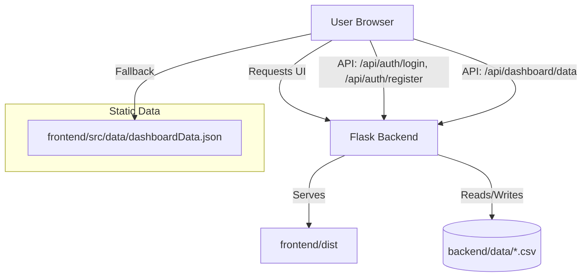

# Aadhaar Setu
A full-stack Aadhaar dashboard prototype with a Flask backend and React/Vite frontend.

This repository combines:
- A Flask backend that handles authentication, dashboard data, and serves the built frontend.
- A React + TypeScript frontend with dashboards, role-based access, appointments, grievances, and charts.
- CSV-based data storage for users, records, and centre metadata.

---

## What is this project?
Aadhaar Setu is an interactive demo of a UIDAI-style service portal and analytics dashboard. It is designed as a proof-of-concept project that can:
- authenticate users using `backend/routes/auth.py`,
- load dashboard metrics from CSV data in `backend/data/`,
- support role-based experiences for public users, block officers, district officers, state officers, and national administrators,
- provide a modern frontend with React, Tailwind, and data visualizations.

---

## Architecture Diagram


---

## Repo structure
- `backend/`
  - `app.py`: Flask application entrypoint.
  - `config.py`: file path definitions and configuration.
  - `routes/auth.py`: login and registration endpoints.
  - `routes/api.py`: dashboard data endpoint.
  - `utils.py`: CSV read/write helpers.
  - `data/`: data source CSV files.
- `frontend/`
  - `src/`: React application source files.
  - `src/contexts/AuthContext.tsx`: login/register and user session management.
  - `src/contexts/DataContext.tsx`: loads live backend data or falls back to static JSON.
  - `src/pages/`: dashboard pages for multiple user roles.
  - `public/`: static assets.
  - `package.json`: frontend dependencies and scripts.

---

## Key behaviors
- **Backend-first mode**: The app first tries to fetch dashboard data from `/api/dashboard/data`.
- **Offline fallback**: If the Flask backend is unavailable, the frontend falls back to `frontend/src/data/dashboardData.json`.
- **User auth**: `POST /api/auth/login` and `POST /api/auth/register` use `backend/data/users.csv`.
- **Dashboard data**: `GET /api/dashboard/data` aggregates records from `backend/data/records.csv` and user metadata.
- **SPA support**: Flask serves the React single-page app and redirects unknown routes to `index.html`.

---

## Prerequisites
- Python 3.8+
- Node.js 16+

---

## Install and run

### Run the backend
```bash
cd aadhaar-setu-build/backend
pip install -r requirements.txt
python app.py
```

The backend starts on port `5001` by default.

### Build or run the frontend
```bash
cd aadhaar-setu-build/frontend
npm install
npm run build
```

Then open `http://localhost:5001` in your browser.

If you want frontend development mode instead of the built app:
```bash
npm run dev
```

---

## Data files
- `backend/data/users.csv`: users and roles used for authentication.
- `backend/data/records.csv`: records used to generate dashboard statistics.
- `backend/data/centres.csv`: centre and location metadata.

Editing these CSV files changes the demo data immediately.

---

## Contributing
To contribute, update this README, improve the dashboard pages under `frontend/src/pages/`, or add new backend APIs in `backend/routes/`.
