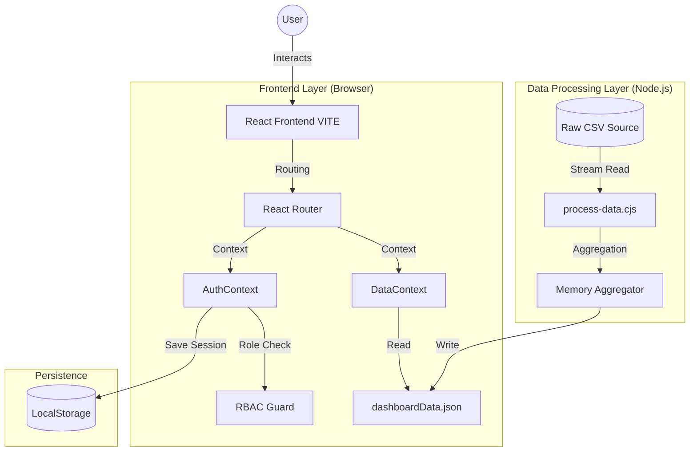

# 🏗️ UIDAI Prototype Hub - System Architecture

## 1. High-Level System Overview
The **UIDAI Prototype Hub** is a client-heavy, offline-first React application designed to visualize complex hierarchical data for the UIDAI hackathon. It leverages a pre-processing pipeline to transform raw CSV data into optimized JSON for high-performance client-side rendering.



---

## 2. Technology Stack

- **Core Framework**: [React 18](https://react.dev/) with TypeScript
- **Build Tool**: [Vite](https://vitejs.dev/) (SWC compiler)
- **Styling**: [Tailwind CSS](https://tailwindcss.com/) + [Shadcn/UI](https://ui.shadcn.com/)
- **State Management**: React Context API
- **Data Visualization**: [Recharts](https://recharts.org/)
- **Icons**: [Lucide React](https://lucide.dev/)
- **Data Processing**: Node.js (fs, csv-parser)

---

## 3. Data Architecture & Pipeline

The system is designed to handle **500,000+ records** efficiently without a live backend database for the prototype phase.

### 3.1 Data Flow
1.  **Ingestion**: `scripts/process-data.cjs` reads the raw `api_data_aadhar_enrolment_0_500000.csv` stream.
2.  **Aggregation**: The script aggregates data in-memory:
    - **By State**: Sums enrollments, age groups, and tracks unique districts.
    - **By District**: Creates `State-District` keyed objects for O(1) lookup.
    - **By Time**: Approximates monthly trends based on date stamps.
3.  **Optimization**: Output is written to `src/data/dashboardData.json`. This file is statically imported by the frontend bundle, ensuring **instant load times**.

### 3.2 Data Models
**State Data Structure:**
```typescript
interface StateData {
  name: string;        // "Uttar Pradesh"
  enrollments: number; // 360,738
  age_0_5: number;     // 174,083
  age_5_17: number;    // 176,839
  districts: number;   // 85
}
```

---

## 4. Component Architecture

The application follows a modular, feature-based structure.

### 4.1 Key Directories
- **`src/pages/dashboards/`**: distinct dashboards for each of the 5 roles (Public, Block, District, State, National).
- **`src/components/layout/`**: `DashboardLayout.tsx` handles the sidebar, header, and active route synchronization.
- **`src/contexts/`**:
    - `AuthContext.tsx`: Manages user session, login/logout, and RBAC roles.
    - `DataContext.tsx`: Loads the JSON data and exposes helper functions (e.g., `getDistrict(id)`).

### 4.2 Role-Based Access Control (RBAC)
The `AuthContext` enforces strict hierarchy:
- **Public**: Access to /dashboard/public
- **Block Officer**: Access to /dashboard/block (Scoped to their Block)
- **District Officer**: Access to /dashboard/district (Scoped to their District)
- **State Officer**: Access to /dashboard/state (Scoped to their State)
- **National Leader**: Full access to /dashboard/national

> **Note**: Intelligent fallback logic ensures that if a user logs in with a designation like "Ministry Secretary", the system automatically infers "National" level privileges.

---

## 5. Security & Persistence

- **Authentication**: Uses a simulated efficient login system. User profiles are stored in `localStorage` to persist sessions across page reloads.
- **Data Safety**: The system is **Read-Only** regarding the core biometric stats. Interactive elements (Appointments, Grievances) are stored locally in the browser for the demo duration.
- **Privacy**: No PII (Personally Identifiable Information) is sent to any external server. All processing happens locally.

---

## 6. Execution Guide

To run the full architecture:

1.  **Process Data** (Optional/One-time):
    ```bash
    node scripts/process-data.cjs
    ```
2.  **Start Frontend**:
    ```bash
    npm run dev
    ```
    *The `start.bat` utility automates both steps.*
